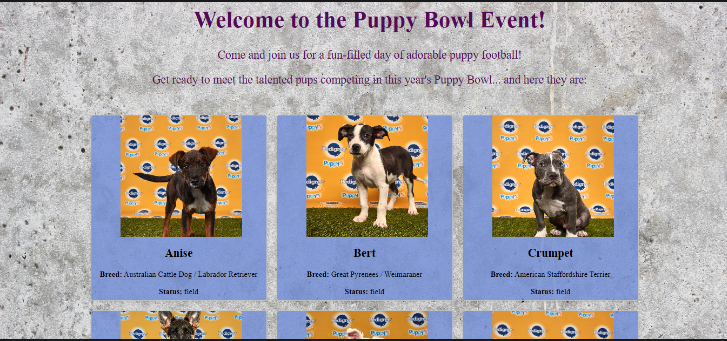
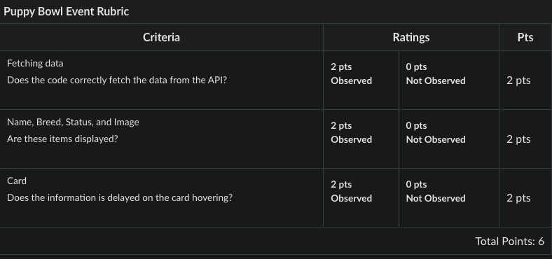

# Block 27C Workshop: Puppy Bowl Event

## Overview
You are tasked with creating a website for the Puppy Bowl Event showcasing team. The website is built using React, and you are required to use the RTK Query library to fetch player details from the provided API endpoint: `https://fsa-puppy-bowl.herokuapp.com/api/${cohort}/players`.

Your goal is to integrate the API into the website and display the player details on the respective web page. The website should have the following features:

1. A single-page application displaying Team player.
2. The details of each player should be kept inside a floating card.
3. Inside each card, the image, name, breed, and status should be visible.
4. Some action on hovering the pointer on the card will be a cherry on top.

The application may appear as shown in the screenshot below:

## Overview of the files in the repo:

1. `public/index.html`: This is the HTML file that serves as the entry point of your React app. It contains a div element with the ID "root", which is where your React components get rendered.
2. `src/index.js`: This is the JavaScript entry point for your React application. It imports the main App component, and uses ReactDOM.render to render this component into the "root" div in your index.html file.
3. `src/App.js`: This file defines the App component, which is the top-level component of your React app. It imports and renders the Players component.
4. `src/api/puppyBowlApi.j`s: This file uses Redux Toolkit's RTK Query to define an API slice for the Puppy Bowl API. It exports a hook, useFetchPlayersQuery, which your components can use to fetch data from this API.
5. `src/app/store.js`: This file creates your Redux store using Redux Toolkit's configureStore function. It includes the reducer and middleware from puppyBowlApi.
6. `src/features/players/Players.js`: This file defines the Players component, which fetches and displays data about Puppy Bowl players using the useFetchPlayersQuery hook from puppyBowlApi.
7. `src/index.css`: This file contains global styles for your app.

## Rubric
